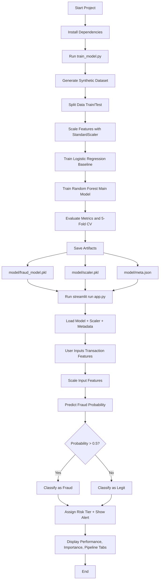

# Credit Card Fraud Detection - Flowchart

## Short Explanation

1. We first train the model offline using `train_model.py`.
2. The script creates synthetic imbalanced fraud data and preprocesses it.
3. It trains two algorithms: Logistic Regression (baseline) and Random Forest (final model).
4. It evaluates performance using ROC-AUC, F1, Recall, Precision, confusion matrix, and 5-fold cross-validation.
5. It saves the trained model, scaler, and metadata in the `model/` folder.
6. The Streamlit app (`app.py`) loads these files and performs real-time fraud prediction from user input.
